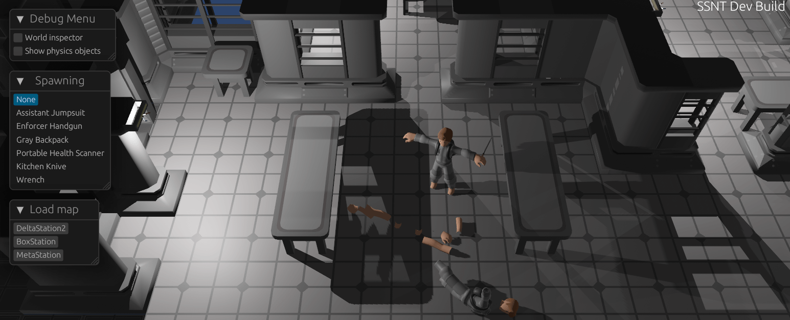

# Space Station: Nanotrasen



SSNT is a remake of the cult classic game "Space Station 13", but in 3D.

> [!WARNING]
> The project is in a very early pre-alpha state. Do not expect an actually enjoyable round of SSNT quite yet.

## How do I play?

You can download the game from the Releases section on GitHub (on the right sidebar).
Please note that there is not much to do and **you will encounter bugs**.

In the future there will be some multiplayer tests and eventually at least one official server.
For now you can host a local server:

```
ssnt.exe host 127.0.0.1:33998
```

Or using docker:

```sh
docker run -p 33998:33998/udp spacestationnt/ssnt --public-address 127.0.0.1
```

Then join your server with a client:

```
ssnt.exe join 127.0.0.1:33998 Name
```

Check out the [key bindings](docs/Keybindings.md).

## Donating

Not yet. There will be an option to fund the development and hosting of SSNT some time later.

## Contributing

The game is made with [Bevy](https://github.com/bevyengine/bevy) using [Rust](https://www.rust-lang.org/). To setup the project [install Rust](https://www.rust-lang.org/learn/get-started) and then use the scripts in the `/bin` folder.

For information on Bevy check out the [Book](https://bevyengine.org/learn/book/introduction/), [Documentation](https://docs.rs/bevy/latest/bevy/) and [Unofficial Cheatbook](https://bevy-cheatbook.github.io/).

Please note that there are still major engine changes in new Bevy releases, so any contributions may be changed or removed when there are large API changes.

## Relation to SS3D

There is another remake of SS13 called [SS3D](https://github.com/RE-SS3D/SS3D).
I used to be a maintainer of SS3D, but after years of little progress I decided to go my own way.

Part of my decision was due to the use of the Unity game engine. When I started adding larger features to the game, I realized the engine would be holding us back.
Unity is also closed-source and commercial, which would be a repeat of the mistake that was made with BYOND.

I'm grateful to everyone in the SS3D community, and hope we can collaborate on making this a reality.
SSNT uses the 3D models and textures made by the SS3D contributors, without them I could have never even attempted this.

## License

The code is licensed as [AGPL 3.0](https://www.gnu.org/licenses/agpl-3.0.en.html). This means that you're free to use the code, but must allow its users to acquire the source code. This is also true if you host a server with modified code.

The assets under `assets/artwork`, `assets/models` and `assets/textures` are licensed as [CC BY-NC-SA 4.0](https://creativecommons.org/licenses/by-nc-sa/4.0/deed.en). All other assets are licensed as [CC0](https://creativecommons.org/public-domain/cc0/).
